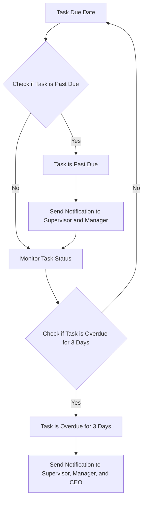
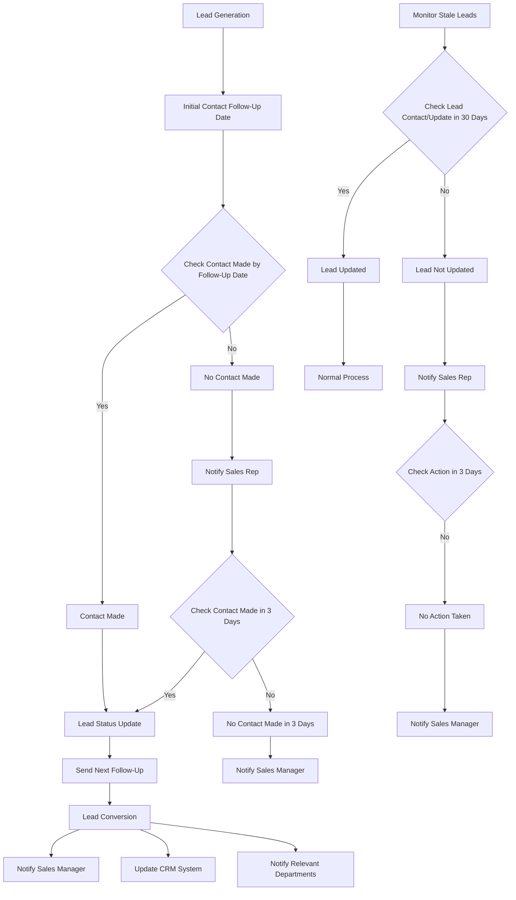
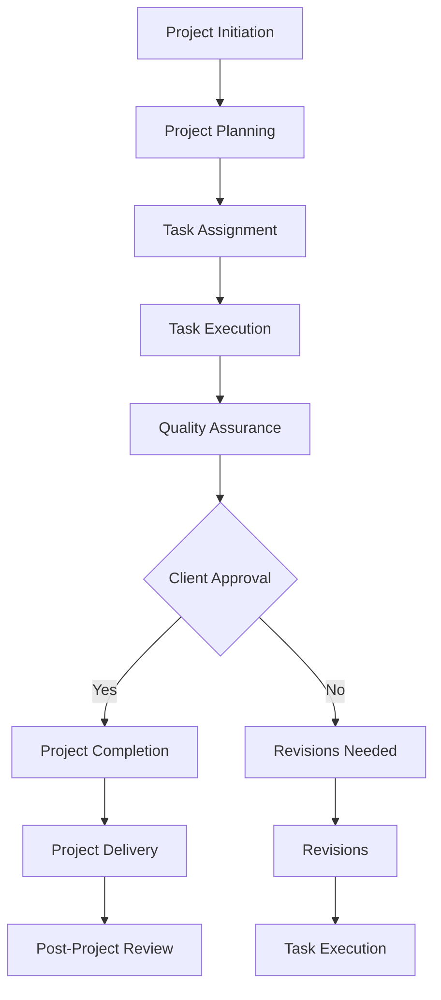
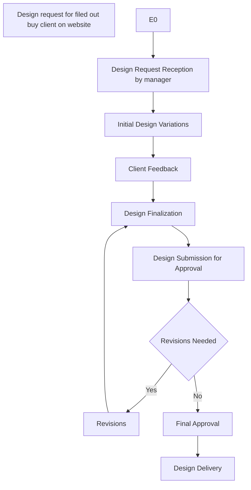
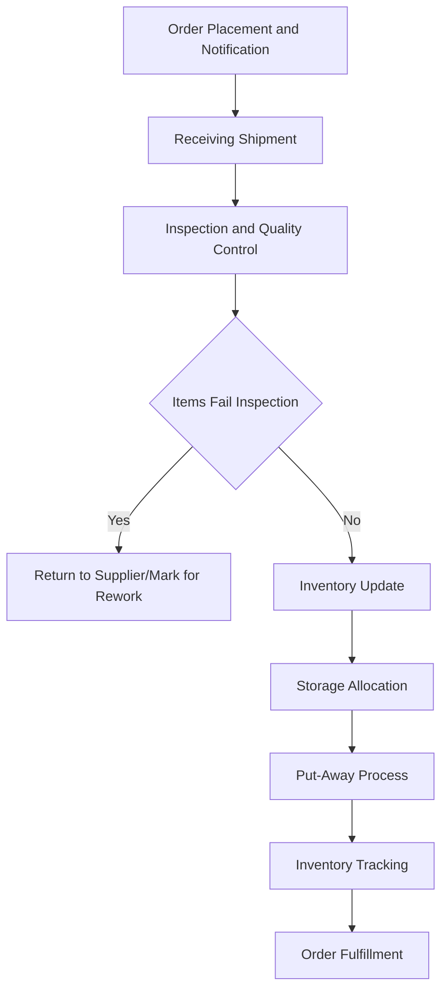
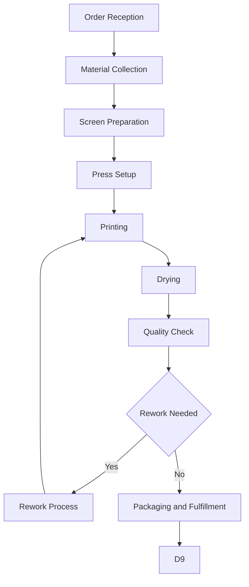
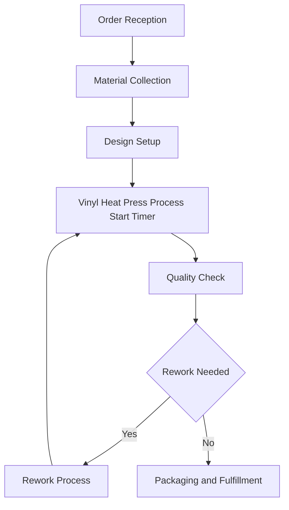
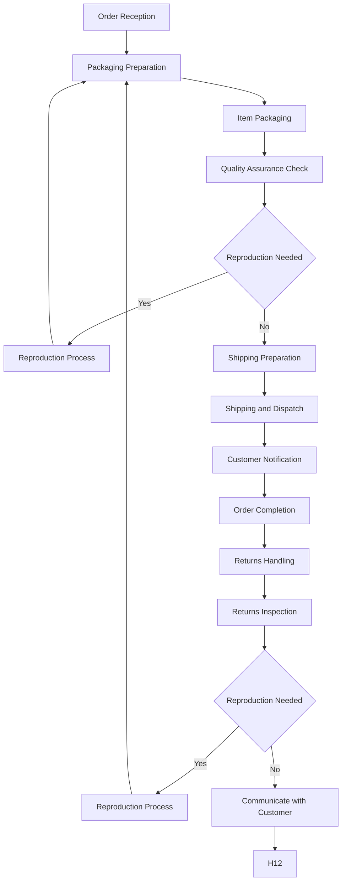
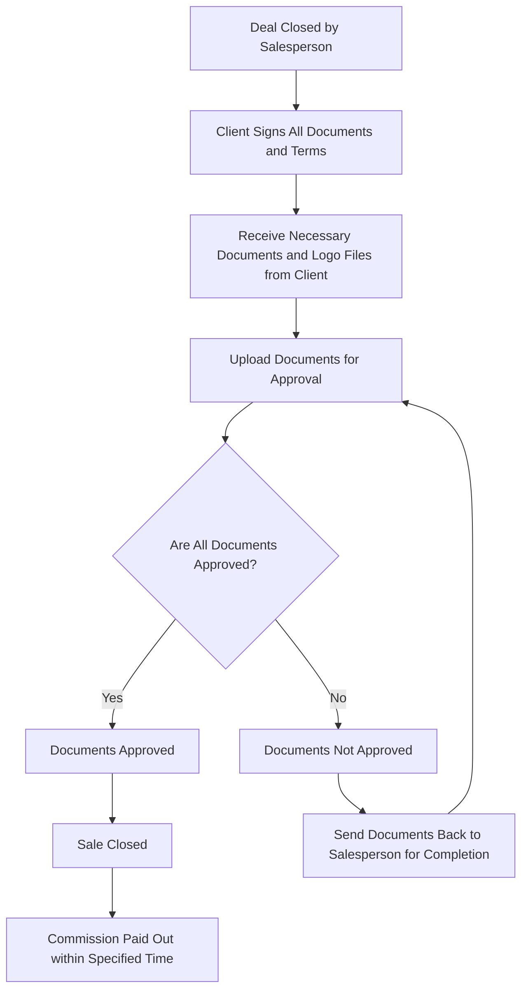

# 4WinnerFlows
Workflows ERP Docs

  OVERDUE TASKS NOTIFICATION
1. Lead Generation: The process starts with generating leads through various marketing and outreach efforts.
2. Initial Contact Follow-Up Date: A follow-up date is set for the initial contact with the lead.
3. Check Contact Made by Follow-Up Date:
  · Contact Made: If contact is made, update the lead status and set the next follow-up.
  · No Contact Made: If no contact is made, notify the sales rep.
  · Check Contact Made in 3 Days: If no contact is made within three days, notify the sales manager.
4. Lead Status Update: Update the lead status accordingly.
  · Send Next Follow-Up: Send the next follow-up message.
  · Lead Conversion: If the lead converts, notify the sales manager, update the CRM system, and notify relevant departments.
5. Monitor Stale Leads:
  · Check Lead Contact/Update in 30 Days: If the lead has not been updated in 30 days, take action.
        · Lead Updated: If the lead is updated, continue with the normal process.
        · Lead Not Updated: If the lead is not updated, notify the sales rep.
        · Check Action in 3 Days: If no action is taken in three days, notify the sales manager.

SALES WORKFLOW
1. Project Initiation: The project begins with initiation.
2. Project Planning: Detailed planning of the project occurs.
3. Task Assignment: Tasks are assigned to team members.
4. Task Execution: Team members execute the assigned tasks.
5. Quality Assurance: The quality of the tasks is assured.
   · Client Approval: The client reviews the deliverables.
      · Revisions Needed: If revisions are needed, they are made and tasks are executed again.
6. Project Completion: The project is completed.
7. Project Delivery: The project deliverables are handed over to the client.
8. Post-Project Review: A review of the project is conducted to identify lessons learned.

DIGITAL AGENCY WORKFLOW

GRAPHIC DESIGN WORKFLOW

RECIEVING WORKFLOW

SCREEN PRINTING WORKFLOW

EMBROIDERY WORKFLOW

HEAT-TRANSFER WORKFLOW

FULFILLMENT WORKFLOW

CLOSING SALES & COMMISSION PAYOUT FLOW

