# 4Winners Workflows
## TOP Workflows ERP
This document serves as a comprehensive guide to understanding the various workflows within our company. It provides a visual representation of each process, from order reception to fulfillment, across different departments. Use the Table of Contents to navigate to specific workflows and gain insights into how our operations are structured and executed.


# Table of Contents
1. [Hierarchy Structure](#hierarchy-structure)
2. [Accounting Workflow](#accounting-workflow)
3. [Overdue Tasks Notification](#overdue-tasks-notification)
4. [Client Onboarding Workflow](#client-onboarding-workflow)
5. [Sales Workflow](#sales-workflow)
6. [Digital Agency Workflow](#digital-agency-workflow)
7. [Graphic Design Workflow](#graphic-design-workflow)
8. [Inventory Manufacturing Pricing](#inventory-manufacturing-pricing)
9. [Receiving/Inventory Workflow](#receiving-inventory-workflow)
10. [Automated Purchase Order Workflow](#automated-purchase-order-workflow)
11. [Shopify Orders Workflow](#shopify-orders-workflow)
12. [Screen Printing Workflow](#screen-printing-workflow)
13. [Embroidery Workflow](#embroidery-workflow)
14. [Heat Transfer Workflow](#heat-transfer-workflow)
15. [Fulfillment Workflow](#fulfillment-workflow)
16. [Closing Sales & Commission Payout Flow](#closing-sales--commission-payout-flow)

## Hierarchy Structure
CEO: Tom is the Chief Executive Officer who oversees all departments.

Sales Department:
Managed by Julie. All sales people report to Julie. All managers and excalations are reported to Julie and/or Tom.
The sales team includes Enzo, Epsteine, and Tom, who also serves as the CEO.
Digital Agency Department:

Digital Agency Department:
Managed by Ty. All departments supervisors report to Ty.
Web Development is supervised by Ty.
Marketing is supervised by Luis.
Graphic Design is supervised by Jordan, with team members Alex and Roselle.
Manufacturing Department:

Production/Warehouse
Managed by Dave. All departments supervisors report to Dave.
Receiving does not have a specified supervisor.
Screen Printing is supervised by TJ, with Brandon, Juana, and Leni as team members.
Embroidery is supervised by Jessica, with Emily and Leni as a team member.
Vinyl Heat Press is supervised by Otero.
Quality Control is supervised by Juana.
Fulfillment/Shipping is supervised by Danale.

```mermaid

%%{init: {'theme': 'forest', 'themeVariables': { 'primaryColor': '#4a90e2', 'edgeLabelBackground': '#ffffff', 'tertiaryColor': '#f4f4f4', 'primaryBorderColor': '#333', 'primaryTextColor': '#333', 'fontFamily': 'Arial'}}}%%

flowchart TD
    classDef default fill:#f9f9f9,stroke:#4a90e2,stroke-width:2px,color:#333,font-family:'Arial',font-size:14px,rx:5,ry:5;
    classDef manager fill:#e3f2fd,stroke:#1e88e5,stroke-width:2px,color:#333,font-family:'Arial',font-size:14px,font-weight:bold,rx:5,ry:5;
    classDef supervisor fill:#c8e6c9,stroke:#43a047,stroke-width:2px,color:#333,font-family:'Arial',font-size:14px,font-weight:bold,rx:5,ry:5;
    classDef team fill:#fff3e0,stroke:#fb8c00,stroke-width:2px,color:#333,font-family:'Arial',font-size:14px,rx:5,ry:5;
    classDef ceo fill:#fff9c4,stroke:#fbc02d,stroke-width:2px,color:#333,font-family:'Arial',font-size:16px,font-weight:bold,rx:5,ry:5;

    CEO[Tom]
    class CEO ceo
    SalesDept[Sales Department]
    SalesMgr[HEAD OF DEPARTMENT: Julie]
    Enzo[Enzo]
    Epsteine[Epsteine]
    TomAsSales[Tom as CEO and Sales]
    CEO --> SalesDept
    SalesDept --> SalesMgr
    SalesMgr --> Enzo
    SalesMgr --> Epsteine
    SalesMgr --> TomAsSales

    class SalesDept,SalesMgr manager
    class Enzo,Epsteine,TomAsSales team

    DigitalAgency[Digital Agency Department]
    DigitalMgr[HEAD OF DEPARTMENT: Ty]
    WebDev[Web Development]
    WebSup[MANAGER: Ty]
    Marketing[Marketing]
    MarkSup[MANAGER: Wells]
    GraphicDesign[Graphic Design]
    GDSup[MANAGER: Jordan]
    Alex[Alex]
    CEO --> DigitalAgency
    DigitalAgency --> DigitalMgr
    DigitalMgr --> WebDev
    WebDev --> WebSup
    DigitalMgr --> Marketing
    Marketing --> MarkSup
    DigitalMgr --> GraphicDesign
    GraphicDesign --> GDSup
    GDSup --> Alex
    GDSup --> CONTRACTORS
    MarkSup --> CONTRACTORS
    WebSup --> CONTRACTORS

    class DigitalAgency,DigitalMgr manager
    class WebDev,Marketing,GraphicDesign supervisor
    class Alex,Roselle team

    Manufacturing[Manufacturing Department]
    ManuMgr[HEAD OF DEPARTMENT: Dave]
    Receiving[Receiving]
    RecSup[MANAGER: Not specified]
    ScreenPrinting[Screen Printing]
    SP[MANAGER: TJ]
    SPJuana[Juana]
    SPLeni[Leni]
    Embroidery[Embroidery]
    EmbSup[MANAGER: Jessica]
    Emily[Emily]
    VinylHeatPress[Vinyl Heat Press]
    VHP[MANAGER: Otero]
    QualityControl[Quality Control]
    QCSup[MANAGER: Juana]
    FulfillmentShipping[Fulfillment/Shipping]
    FulfillSup[MANAGER: Danale]
    CEO --> Manufacturing
    Manufacturing --> ManuMgr
    ManuMgr --> Receiving
    Receiving --> RecSup
    ManuMgr --> ScreenPrinting
    ScreenPrinting --> SP
    SP --> SPJuana
    SP --> SPLeni
    ManuMgr --> Embroidery
    Embroidery --> EmbSup
    EmbSup --> Emily
    EmbSup --> Leni
    ManuMgr --> VinylHeatPress
    VinylHeatPress --> VHP
    ManuMgr --> QualityControl
    QualityControl --> QCSup
    ManuMgr --> FulfillmentShipping
    FulfillmentShipping --> FulfillSup
    QCSup --> Leni

    class Manufacturing,ManuMgr manager
    class Receiving,ScreenPrinting,Embroidery,VinylHeatPress,QualityControl,FulfillmentShipping supervisor
    class SPBrandon,SPJuana,SPLeni,Emily team

```
[Back to top](#TOP)

##DIAMOND PRICING RULE WORKFLOW

flowchart TD
    A[Customer Places Order] --> B{Lead Time Provided?}
    B -- Yes --> C{Lead Time >= 6 weeks?}
    C -- Yes --> D[Apply 20% Discount]
    C -- No --> E{Lead Time >= 4 weeks?}
    E -- Yes --> F[Apply 15% Discount]
    E -- No --> G{Lead Time >= 2 weeks?}
    G -- Yes --> H[Apply 10% Discount]
    G -- No --> I{Lead Time >= 1 week?}
    I -- Yes --> J[Apply 5% Discount]
    I -- No --> K[Apply 30% Mark-up]
    B -- No --> L[Lead Time Required]

    style A fill:#bbf,stroke:#333,stroke-width:2px;
    style D fill:#bfb,stroke:#333,stroke-width:2px;
    style F fill:#bfb,stroke:#333,stroke-width:2px;
    style H fill:#bfb,stroke:#333,stroke-width:2px;
    style J fill:#bfb,stroke:#333,stroke-width:2px;
    style K fill:#f99,stroke:#333,stroke-width:2px;


## ACCOUNTING WORKFLOW

1. Client Information Collection:
    Store client contact information, including state or country, in the client profile within Odoo ERP.

2. Product vs. Service Tagging:
    Use tags to differentiate between products (goods) and services. Services are tagged as "No Tax".

3. Tax Rate Determination:
    Utilize a software or plugin to automatically determine the correct tax rate based on the client's state or country.

4. Inventory Management for Services:
    Services are inventoried under a "No Tax" category to ensure they are not taxed.

5. Vendor Tax Payments:
    Track taxes paid on vendor purchases, specifically for Nevada state tax, within Odoo ERP.

6. Tax Details in Customer Profile:
    Build tax details into the customer profile for accurate tax calculations during invoicing.

7. Invoicing Process:
    Invoices are generated using services and items in the inventory, ensuring tags are correctly applied.
    Tom checks and approves invoices to ensure accuracy before sending them out.

8. Accounts Management:
    Use three checking accounts for payroll and expenses.
    Use a savings account for profit and taxes.
    Taxes paid on invoices are automatically transferred to the savings account.
    Remaining amounts after taxes and expenses are transferred to the savings account as profit.

9. Tracking Damages/Losses:
    Damages and losses are tracked for writeoffs in Odoo ERP.

10. Compliance and Reporting:
     Implement a compliance and reporting policy (recommendation to follow).

11. Integration with Odoo ERP:
     Use outofthebox functions, plugins, and custom solutions to integrate all processes into Odoo ERP.


 ### Recommendations for Compliance and Reporting Policy

1. Compliance:
    Ensure all financial transactions are recorded accurately and timely.
    Maintain detailed records of all sales, purchases, tax payments, and expenses.
    Regularly audit financial records to ensure compliance with state and federal tax laws.
    Stay updated with changes in tax laws and regulations.

2. Reporting:
    Generate monthly, quarterly, and annual financial reports.
    Include detailed breakdowns of revenues, expenses, taxes paid, and profits.
    Use Odoo ERP’s reporting tools to automate report generation and ensure consistency.

```mermaid

%%{init: {'theme': 'forest', 'themeVariables': { 'primaryColor': '#4a90e2', 'edgeLabelBackground': '#ffffff', 'tertiaryColor': '#f4f4f4', 'primaryBorderColor': '#333', 'primaryTextColor': '#333', 'fontFamily': 'Arial'}}}%%

flowchart TD
    classDef default fill:#f9f9f9,stroke:#4a90e2,stroke-width:2px,color:#333,font-family:'Arial',font-size:14px,rx:5,ry:5;

    subgraph Client_Information
        A1["Collect Client Info"]
        A2["Store in Client Profile"]
    end
    
    subgraph Product_Service_Management
        B1["Tag Products and Services"]
        B2["Manage Services Inventory (No Tax)"]
    end
    
    subgraph Tax_Management
        C1["Determine Tax Rate by State/Country"]
        C2["Track Vendor Tax Payments"]
        C3["Build Tax Details in Customer Profile"]
    end
    
    subgraph Invoicing
        D1["Generate Invoice"]
        D2["Tom Checks and Approves Invoice"]
        D3["Send Invoice"]
    end
    
    subgraph Accounts_Management
        E1["Track Accounts for Payroll and Expenses"]
        E2["Transfer Taxes to Savings Account"]
        E3["Calculate Profit and Transfer to Savings"]
    end
    
    subgraph Damages_Losses_Tracking
        F1["Track Damages and Losses"]
        F2["Write Off Damages and Losses"]
    end
    
    subgraph Compliance_Reporting
        G1["Implement Compliance Policy"]
        G2["Generate Reports"]
    end
    
    
    A1 --> A2
    A2 --> B1
    B1 --> B2
    B2 --> C1
    C1 --> C2
    C2 --> C3
    C3 --> D1
    D1 --> D2
    D2 --> D3
    D3 --> E1
    E1 --> E2
    E2 --> E3
    E3 --> F1
    F1 --> F2
    F2 --> G1
    G1 --> G2


```
[Back to top](#TOP)


## OVERDUE TASKS NOTIFICATION

 Notification Flowchart for Overdue Tasks
1. Task Due Date: The due date for the task is set.
2. Check if Task is Past Due:
   Task is Past Due then If the task is past due, a notification is sent to the supervisor and manager.
3. Monitor Task Status: The task status is monitored.
4. Check if Task is Overdue for 3 Days:
    Task is Overdue for 3 Days: If the task is overdue for three days, a notification is sent to the supervisor, manager, and CEO.


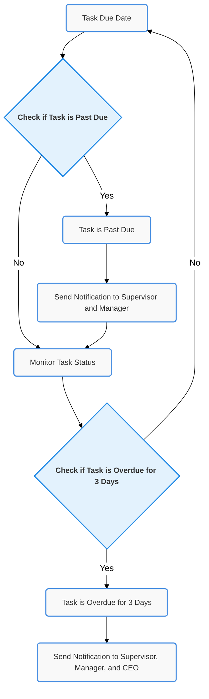
[Back to top](#TOP)

## Client Onboarding Workflow

1. Sale Closed
    The sales process is completed, and a sale is made.

2. Send Welcome Email
    A welcome email is sent to the new client to initiate the onboarding process.

3. Schedule 6090 Minute Meeting
    Schedule a detailed meeting with the client to discuss the project and gather necessary information.

4. Gather Client Information
    Collect all relevant information about the client's business, including styles, color palettes, fonts, and images.

5. Fill Out All Necessary Forms
    Complete all required forms to formalize the project details and requirements.

6. Sign Terms and Conditions
    Ensure that the client signs all terms and conditions to proceed with the project.

7. Begin Process
    Start the project process by organizing and planning the required tasks.

8. Send Emails Along Each Step
    Communicate with the client regularly by sending emails at each step of the process to keep them informed.

9. 30 Days Setup Time for Departments
    Allocate approximately 30 days for each department to gather information, create mockups, and prepare for approvals.

10. Start Mocking Up Designs
     Begin creating design mockups based on the gathered information.

11. Get Approvals
     Obtain necessary approvals from the client to proceed with the final design and implementation.

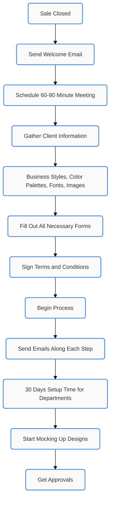
[Back to top](#TOP)

## SALES WORKFLOW

1. Lead Generation: The process starts with generating leads through various marketing and outreach efforts.
2. Initial Contact FollowUp Date: A followup date is set for the initial contact with the lead.
3. Check Contact Made by FollowUp Date:
    Contact Made: If contact is made, update the lead status and set the next followup.
    No Contact Made: If no contact is made, notify the sales rep.
    Check Contact Made in 3 Days: If no contact is made within three days, notify the sales manager.
4. Lead Status Update: Update the lead status accordingly.
    Send Next FollowUp: Send the next followup message.
    Lead Conversion: If the lead converts, notify the sales manager, update the CRM system, and notify relevant departments.
5. Monitor Stale Leads:
    Check Lead Contact/Update in 30 Days: If the lead has not been updated in 30 days, take action.
      Lead Updated: If the lead is updated, continue with the normal process.
      Lead Not Updated: If the lead is not updated, notify the sales rep.
      Check Action in 3 Days: If no action is taken in three days, notify the sales manager.

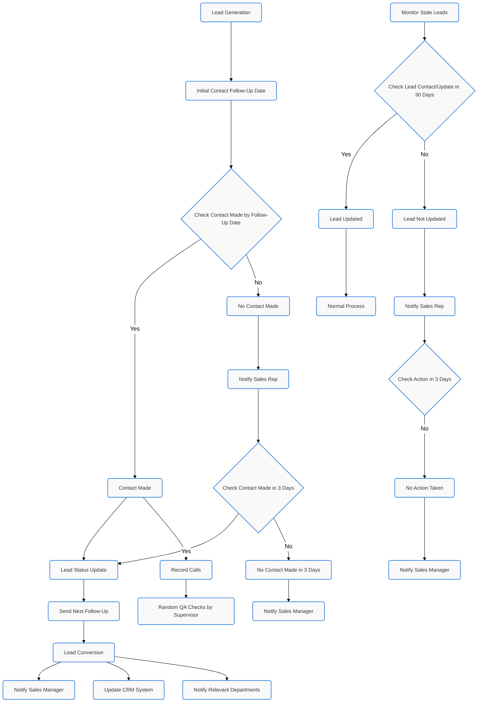
[Back to top](#TOP)

## DIGITAL AGENCY WORKFLOW

1. Project Initiation: The project begins with initiation.
2. Project Planning: Detailed planning of the project occurs.
3. Task Assignment: Tasks are assigned to team members.
4. Task Execution: Team members execute the assigned tasks.
5. Quality Assurance: The quality of the tasks is assured.
    Client Approval: The client reviews the deliverables.
       Revisions Needed: If revisions are needed, they are made and tasks are executed again.
6. Project Completion: The project is completed.
7. Project Delivery: The project deliverables are handed over to the client.
8. PostProject Review: A review of the project is conducted to identify lessons learned.
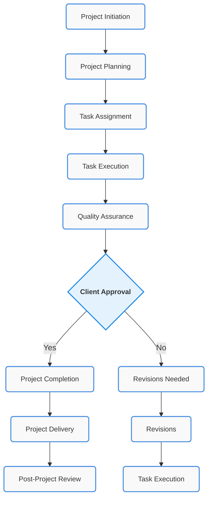
[Back to top](#TOP)

## GRAPHIC DESIGN WORKFLOW

1. Design Request Reception: Design requests are received.
2. Initial Design Variations: Initial design variations are created.
3. Client Feedback: Client provides feedback on the designs.
4. Design Finalization: The final design is prepared based on feedback.
5. Design Submission for Approval:
    Revisions Needed: If revisions are needed, they are made.
6. Final Approval: The final design is approved by the client.
7. Design Delivery: The approved design is delivered to the client.
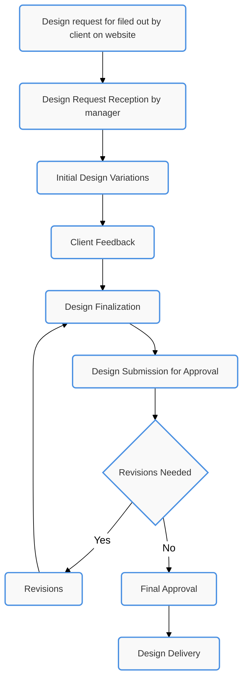
[Back to top](#TOP)

## INVENTORY MANUFACTURING PRICING 

 Pricing Tiers
1. Diamond
    Blank Tee: $5
    Embroidery Fee: $7.49
    Screen Printing Fee: $4.49

2. Platinum
    Blank Tee: $7
    Embroidery Fee: $9.49
    Screen Printing Fee: $7.49

3. Bronze
    Blank Tee: $8
    Embroidery Fee: $10.49
    Screen Printing Fee: $8.49

4. Nonmember
    Blank Tee: $10
    Embroidery Fee: $12.49
    Screen Printing Fee: $10.49

 Inventory and Materials
 Materials
   Ink: $0.50
   Thread: $0.50
 Services
   Embroidery
   Screen Printing

 Workflow
1. Inventory: All raw materials and services are stored in inventory.
2. Manufacturer Order: When an order is placed, materials are allocated from the inventory.
3. Final Product Assembly: The allocated materials and services are used to assemble the final product.
4. Shipping: The completed product is shipped to the customer.
5. Customer: The customer receives the delivered product.

 Detailed Process
 Order Processing: Orders are processed based on the pricing tier of the customer (Diamond, Platinum, Bronze, Nonmember).
 Inventory Allocation: Materials (ink and thread) and services (embroidery, screen printing) are taken from inventory for each order.
 Product Assembly: The final product is assembled using the allocated materials and services.
 Shipping and Delivery: The completed product is shipped to the customer.

Each membership level affects the pricing of the blank tee, embroidery fee, and screen printing fee, while the material costs (ink and thread) remain constant across all membership levels.


```mermaid

graph TD
  Inventory["Inventory"]
  Order["Manufacturer Order"]
  Inventory --> |"Allocate Materials"| Order
  Order --> |"Process Order"| Assembly["Final Product Assembly"]
  Assembly --> |"Completed"| Shipping["Shipping"]
  Shipping --> |"Delivered"| Customer["Customer"]
  Pricing["Pricing Tiers"]
  Pricing --> Diamond["Diamond"]
  Pricing --> Platinum["Platinum"]
  Pricing --> Bronze["Bronze"]
  Pricing --> NonMember["Non-member"]
  Diamond --> DiamondTee["Blank Tee $5"]
  Diamond --> DiamondEmbroideryFee["Embroidery Fee $7.49"]
  Diamond --> DiamondScreenPrintingFee["Screen Printing Fee $4.49"]
  Platinum --> PlatinumTee["Blank Tee $7"]
  Platinum --> PlatinumEmbroideryFee["Embroidery Fee $9.49"]
  Platinum --> PlatinumScreenPrintingFee["Screen Printing Fee $7.49"]
  Bronze --> BronzeTee["Blank Tee $8"]
  Bronze --> BronzeEmbroideryFee["Embroidery Fee $10.49"]
  Bronze --> BronzeScreenPrintingFee["Screen Printing Fee $8.49"]
  NonMember --> NonMemberTee["Blank Tee $10"]
  NonMember --> NonMemberEmbroideryFee["Embroidery Fee $12.49"]
  NonMember --> NonMemberScreenPrintingFee["Screen Printing Fee $10.49"]
  Materials["Materials"]
  Services["Services"]
  Materials --> Ink["Ink $0.50"]
  Materials --> Thread["Thread $0.50"]
  Services --> Embroidery["Embroidery"]
  Services --> ScreenPrinting["Screen Printing"]
  Diamond --> DiamondOrder["Diamond Order"]
  Platinum --> PlatinumOrder["Platinum Order"]
  Bronze --> BronzeOrder["Bronze Order"]
  NonMember --> NonMemberOrder["Non-member Order"]
  DiamondOrder --> |"Uses"| Inventory
  PlatinumOrder --> |"Uses"| Inventory
  BronzeOrder --> |"Uses"| Inventory
  NonMemberOrder --> |"Uses"| Inventory
  Assembly --> DiamondTee
  Assembly --> PlatinumTee
  Assembly --> BronzeTee
  Assembly --> NonMemberTee
  Assembly --> Embroidery
  Assembly --> ScreenPrinting
  
  ```

  [Back to top](#TOP)

## RECEIVING INVENTORY WORKFLOW

1. Order Placement and Notification: Orders are placed and notifications are sent.
2. Receiving Shipment: The shipment is received.
3. Inspection and Quality Control:
    Items Fail Inspection: If items fail inspection, they are returned to the supplier or marked for rework.
4. Inventory Update: The inventory is updated.
5. Storage Allocation: Allocate storage space for the items.
6. PutAway Process: The items are put away in their designated storage locations.
7. Inventory Tracking: The inventory is tracked.
8. Order Fulfillment: Orders are fulfilled from the inventory.

```mermaid

%%{init: {'theme': 'forest', 'themeVariables': { 'primaryColor': '#4a90e2', 'edgeLabelBackground': '#ffffff', 'tertiaryColor': '#f4f4f4', 'primaryBorderColor': '#333', 'primaryTextColor': '#333', 'fontFamily': 'Arial'}}}%%

flowchart TD
    classDef default fill:#f9f9f9,stroke:#4a90e2,stroke-width:2px,color:#333,font-family:'Arial',font-size:14px,rx:5,ry:5;
    classDef decision fill:#e3f2fd,stroke:#1e88e5,stroke-width:2px,color:#333,font-family:'Arial',font-size:14px,font-weight:bold,rx:5,ry:5;

    C1[Order Placement and Notification]
    C2[Receiving Shipment]
    C3[Inspection and Quality Control]
    C3a{Items Fail Inspection}
    C3b[Return to Supplier/Mark for Rework]
    C4[Inventory Update]
    C5[Storage Allocation]
    C6[Put-Away Process]
    C7[Inventory Tracking]
    C8[Order Fulfillment]

    class C3a decision

    C1 --> C2
    C2 --> C3
    C3 --> C3a
    C3a -->|Yes| C3b
    C3a -->|No| C4
    C4 --> C5
    C5 --> C6
    C6 --> C7
    C7 --> C8

```
[Back to top](#TOP)

## AUTOMATED PURCHASE ORDER WORKFLOW

1. Order Received:
    When a new order is placed, it is immediately received and logged into the system.

2. Collect Customer & Order Details:
    The necessary customer information and order details are collected to ensure accurate processing and fulfillment.

3. Check Inventory:
    The system checks the current inventory levels for the ordered items.
    If the items are in stock, the process moves directly to Package and Ship.
    If the items are out of stock or low stock (inventory below two units for any variant), the workflow initiates the creation of a purchase order.

4. Create Purchase Order:
    The system automatically generates a purchase order for the necessary items that are either out of stock or below the minimum stock level.

5. Notify CEO for Purchase Confirmation:
    A notification is sent to the CEO to review and confirm the purchase order. This step ensures that all purchases are authorized at the highest level of the organization.

6. Confirm Purchase of Goods:
    Upon receiving confirmation from the CEO, the purchase order is finalized and the goods are ordered from the supplier.

7. Receive Purchase Order:
    Once the ordered goods are delivered, they are received into the inventory system, updating stock levels accordingly.

8. Allocate Items to Departments:
    The received items are then allocated to the appropriate departments based on the order requirements.

9. Embroidery / Screen Printing / Vinyl Heat Press:
    The items are processed through the necessary decoration departments, which may include embroidery, screen printing, or vinyl heat press.

10. Order Fulfilled:
     After the decoration process is completed, the order is marked as fulfilled.

11. Package and Ship:
     The completed order is packaged and shipped to the customer, concluding the workflow.


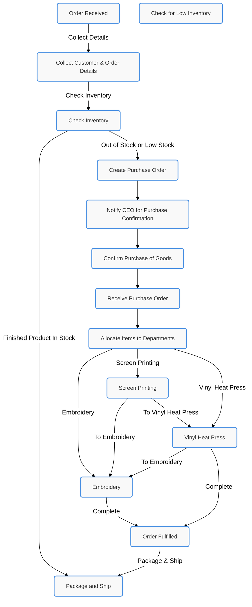
[Back to top](#TOP)

## SHOPIFY ORDERS WORKFLOW

1. Order Received: The order is received from the client's Shopify store.
2. Collect Customer & Order Details: The system collects the company name, customer name, and shipping address.
3. Check Inventory: The inventory is checked to see if the items are in stock.
     If the items are in stock, they proceed directly to packaging and shipping.
     If the items are out of stock, they are allocated to the appropriate departments for production.
4. Allocate Items to Departments: Items are allocated to different departments based on their decoration needs.
     Screen Printing: Items that need screen printing are processed first.
     Vinyl Heat Press: Items that require vinyl heat pressing are processed next.
     Embroidery: Items that require embroidery are processed last.
5. Order Fulfilled: Once all necessary decorations are complete, the order is fulfilled.
6. Package and Ship: The items are packaged and shipped to the customer.

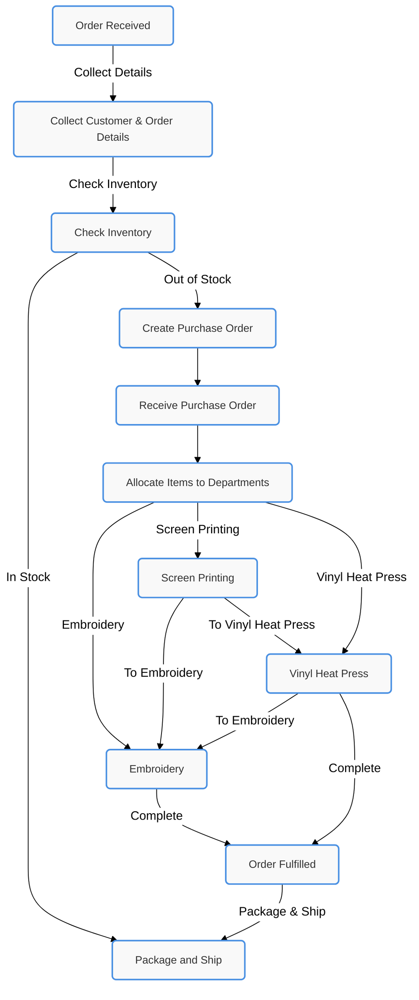

[Back to top](#TOP)

## SCREEN PRINTING WORKFLOW

1. Order Reception: Orders are received.
2. Material Collection: Materials required for the order are collected.
3. Screen Preparation: Screens are prepared for printing.
4. Press Setup: The press is set up for printing.
5. Printing: The printing process is executed.
6. Drying: Printed items are dried.
7. Quality Check: Quality of the printed items is checked.
    Rework Needed: If rework is needed, the items are sent back for rework.
8. Packaging and Fulfillment: Items are packaged and fulfilled.

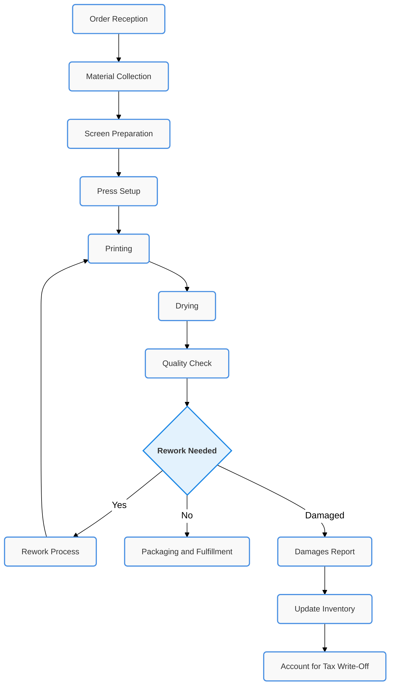
[Back to top](#TOP)

## EMBROIDERY WORKFLOW

1. Order Reception: Orders are received.
2. Material Collection: Materials required for the order are collected.
3. Design Setup: Design is set up for embroidery.
4. Embroidery Process (Start Job Timer): Embroidery process starts, and the job timer is initiated.
5. Quality Check: The quality of the embroidered items is checked.
    Rework Needed: If rework is needed, the items are sent back for rework.
6. Packaging and Fulfillment: Embroidered items are packaged and fulfilled.
7. 
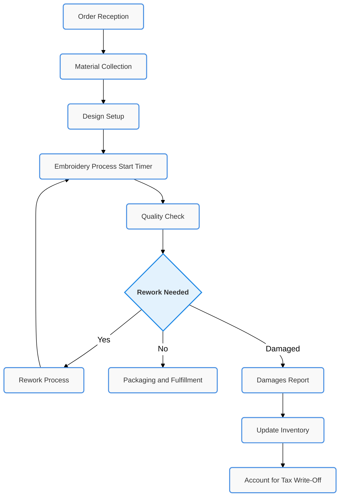
[Back to top](#TOP)


## HEAT TRANSFER WORKFLOW

1. Order Reception: Orders are received.
2. Material Collection: Materials required for the order are collected.
3. Design Setup: Design is set up for the vinyl heat press.
4. Vinyl Heat Press Process (Start Job Timer): The vinyl heat press process starts, and the job timer is initiated.
5. Quality Check: The quality of the heatpressed items is checked.
    Rework Needed: If rework is needed, the items are sent back for rework.
6. Packaging and Fulfillment: Heatpressed items are packaged and fulfilled.
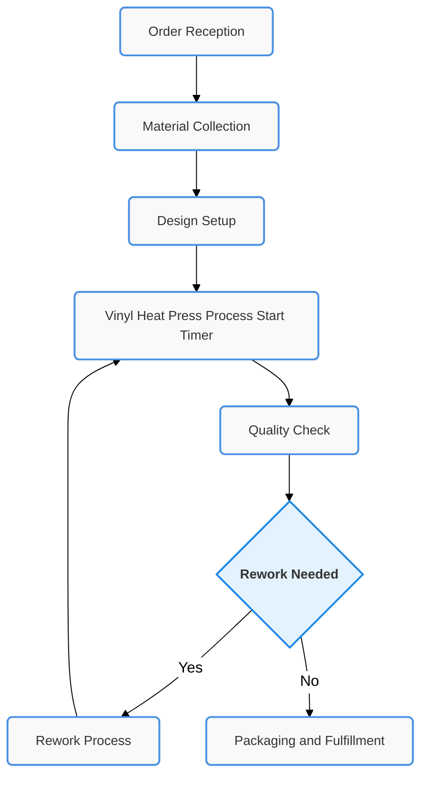
[Back to top](#TOP)

## FULFILLMENT WORKFLOW

1. Order Reception: Orders are received.
2. Packaging Preparation: Packaging is prepared.
3. Item Packaging: Items are packaged.
4. Quality Assurance Check: The quality of the packaging is checked.
    Reproduction Needed: If reproduction is needed, the process is initiated.
5. Shipping Preparation: Items are prepared for shipping.
6. Shipping and Dispatch: Items are shipped and dispatched.
7. Customer Notification: Customers are notified of the shipment.
8. Order Completion: Orders are marked as complete.
9. Returns Handling: Returns are handled.
10. Returns Inspection: Returns are inspected.
     Reproduction Needed: If reproduction is needed, the process is initiated.
11. Communicate with Customer: Communication is maintained with the customer.
    
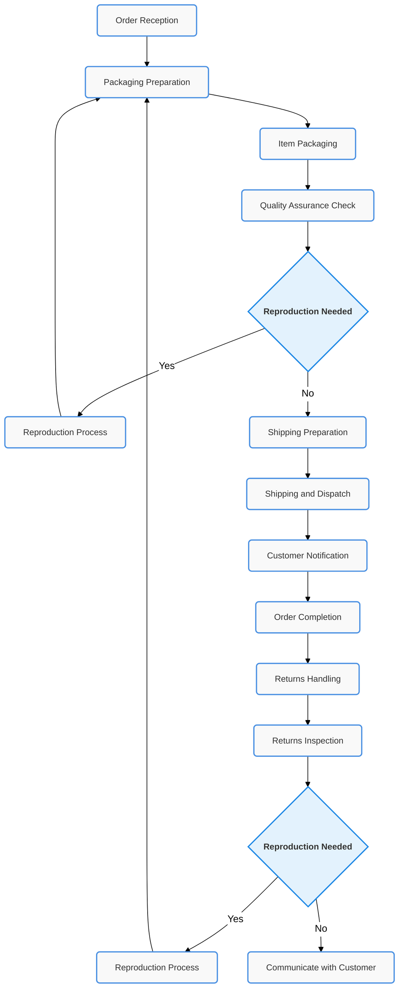
[Back to top](#TOP)

## CLOSING SALES & COMMISSION PAYOUT FLOW

1. Deal Closed by Salesperson: The salesperson closes the deal with the client.
2. Client Signs All Documents and Terms: The client signs all necessary documents and terms.
3. Receive Necessary Documents and Logo Files from Client: The necessary documents and logo files are received from the client.
4. Upload Documents for Approval: The documents are uploaded for approval.
5. Are All Documents Approved?:
    Documents Approved: If all documents are approved, proceed to close the sale.
    Documents Not Approved: If documents are not approved, they are sent back to the salesperson for completion and resubmission.
6. Sale Closed: The sale is marked as closed.
7. Commission Paid Out within Specified Time: The commission is paid out to the salesperson within the specified time.
8. Send Documents Back to Salesperson for Completion: If documents are not approved, they are sent back to the salesperson for completion and resubmission.

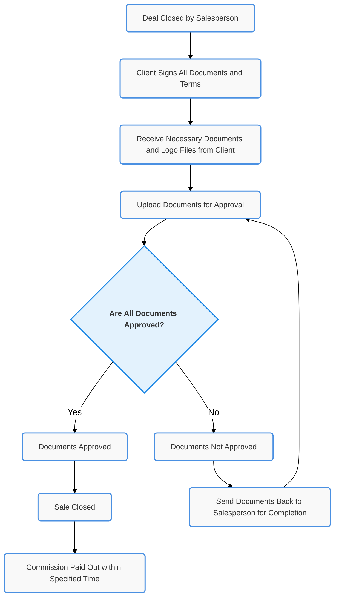
[Back to top](#TOP)
