# 4Winners Workflows
## TOP Workflows ERP
This document serves as a comprehensive guide to understanding the various workflows within our company. It provides a visual representation of each process, from order reception to fulfillment, across different departments. Use the Table of Contents to navigate to specific workflows and gain insights into how our operations are structured and executed.


# Table of Contents
1. [Hierarchy Structure](#hierarchy-structure)
2. [Overdue Tasks Notification](#overdue-tasks-notification)
3. [Sales Workflow](#sales-workflow)
4. [Digital Agency Workflow](#digital-agency-workflow)
5. [Graphic Design Workflow](#graphic-design-workflow)
6. [Receiving/Inventory Workflow](#receiving-inventory-workflow)
7. [Automated Purchase Order Workflow](#automated-purchase-order-workflow)
8. [Shopify Orders Workflow](#shopify-orders-workflow)
9. [Screen Printing Workflow](#screen-printing-workflow)
10. [Embroidery Workflow](#embroidery-workflow)
11. [Heat Transfer Workflow](#heat-transfer-workflow)
12. [Fulfillment Workflow](#fulfillment-workflow)
13. [Closing Sales & Commission Payout Flow](#closing-sales--commission-payout-flow)

## Hierarchy Structure
CEO: Tom is the Chief Executive Officer who oversees all departments.

Sales Department:
Managed by Julie. All sales people report to Julie. All managers and excalations are reported to Julie and/or Tom.
The sales team includes Enzo, Epsteine, and Tom, who also serves as the CEO.
Digital Agency Department:

Digital Agency Department:
Managed by Ty. All departments supervisors report to Ty.
Web Development is supervised by Ty.
Marketing is supervised by Luis.
Graphic Design is supervised by Jordan, with team members Alex and Roselle.
Manufacturing Department:

Production/Warehouse
Managed by Dave. All departments supervisors report to Dave.
Receiving does not have a specified supervisor.
Screen Printing is supervised by TJ, with Brandon, Juana, and Leni as team members.
Embroidery is supervised by Jessica, with Emily and Leni as a team member.
Vinyl Heat Press is supervised by Otero.
Quality Control is supervised by Juana.
Fulfillment/Shipping is supervised by Danale.

```mermaid

%%{init: {'theme': 'forest', 'themeVariables': { 'primaryColor': '#4a90e2', 'edgeLabelBackground': '#ffffff', 'tertiaryColor': '#f4f4f4', 'primaryBorderColor': '#333', 'primaryTextColor': '#333', 'fontFamily': 'Arial'}}}%%

flowchart TD
    classDef default fill:#f9f9f9,stroke:#4a90e2,stroke-width:2px,color:#333,font-family:'Arial',font-size:14px,rx:5,ry:5;
    classDef manager fill:#e3f2fd,stroke:#1e88e5,stroke-width:2px,color:#333,font-family:'Arial',font-size:14px,font-weight:bold,rx:5,ry:5;
    classDef supervisor fill:#c8e6c9,stroke:#43a047,stroke-width:2px,color:#333,font-family:'Arial',font-size:14px,font-weight:bold,rx:5,ry:5;
    classDef team fill:#fff3e0,stroke:#fb8c00,stroke-width:2px,color:#333,font-family:'Arial',font-size:14px,rx:5,ry:5;
    classDef ceo fill:#fff9c4,stroke:#fbc02d,stroke-width:2px,color:#333,font-family:'Arial',font-size:16px,font-weight:bold,rx:5,ry:5;

    CEO[Tom]
    class CEO ceo
    SalesDept[Sales Department]
    SalesMgr[Manager: Julie]
    Enzo[Enzo]
    Epsteine[Epsteine]
    TomAsSales[Tom as CEO and Sales]
    CEO --> SalesDept
    SalesDept --> SalesMgr
    SalesMgr --> Enzo
    SalesMgr --> Epsteine
    SalesMgr --> TomAsSales

    class SalesDept,SalesMgr manager
    class Enzo,Epsteine,TomAsSales team

    DigitalAgency[Digital Agency Department]
    DigitalMgr[Manager: Ty]
    WebDev[Web Development]
    WebSup[Supervisor: Ty]
    Marketing[Marketing]
    MarkSup[Supervisor: Luis]
    GraphicDesign[Graphic Design]
    GDSup[Supervisor: Jordan]
    Alex[Alex]
    Roselle[Roselle]
    CEO --> DigitalAgency
    DigitalAgency --> DigitalMgr
    DigitalMgr --> WebDev
    WebDev --> WebSup
    DigitalMgr --> Marketing
    Marketing --> MarkSup
    DigitalMgr --> GraphicDesign
    GraphicDesign --> GDSup
    GDSup --> Alex
    GDSup --> Roselle

    class DigitalAgency,DigitalMgr manager
    class WebDev,Marketing,GraphicDesign supervisor
    class Alex,Roselle team

    Manufacturing[Manufacturing Department]
    ManuMgr[Manager: Dave]
    Receiving[Receiving]
    RecSup[Supervisor: Not specified]
    ScreenPrinting[Screen Printing]
    SP[Supervisor: TJ]
    SPBrandon[Brandon]
    SPJuana[Juana]
    SPLeni[Leni]
    Embroidery[Embroidery]
    EmbSup[Supervisor: Jessica]
    Emily[Emily]
    VinylHeatPress[Vinyl Heat Press]
    VHP[Supervisor: Otero]
    QualityControl[Quality Control]
    QCSup[Supervisor: Juana]
    FulfillmentShipping[Fulfillment/Shipping]
    FulfillSup[Supervisor: Danale]
    CEO --> Manufacturing
    Manufacturing --> ManuMgr
    ManuMgr --> Receiving
    Receiving --> RecSup
    ManuMgr --> ScreenPrinting
    ScreenPrinting --> SP
    SP --> SPJuana
    SP --> SPLeni
    SP --> SPBrandon
    ManuMgr --> Embroidery
    Embroidery --> EmbSup
    EmbSup --> Emily
    ManuMgr --> VinylHeatPress
    VinylHeatPress --> VHP
    ManuMgr --> QualityControl
    QualityControl --> QCSup
    ManuMgr --> FulfillmentShipping
    FulfillmentShipping --> FulfillSup

    class Manufacturing,ManuMgr manager
    class Receiving,ScreenPrinting,Embroidery,VinylHeatPress,QualityControl,FulfillmentShipping supervisor
    class SPBrandon,SPJuana,SPLeni,Emily team

```
[Back to top](#TOP)


## OVERDUE TASKS NOTIFICATION

 Notification Flowchart for Overdue Tasks
1. Task Due Date: The due date for the task is set.
2. Check if Task is Past Due:
   Task is Past Due then If the task is past due, a notification is sent to the supervisor and manager.
3. Monitor Task Status: The task status is monitored.
4. Check if Task is Overdue for 3 Days:
    Task is Overdue for 3 Days: If the task is overdue for three days, a notification is sent to the supervisor, manager, and CEO.


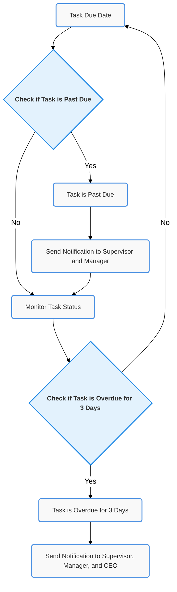
[Back to top](#TOP)

## SALES WORKFLOW

1. Lead Generation: The process starts with generating leads through various marketing and outreach efforts.
2. Initial Contact FollowUp Date: A followup date is set for the initial contact with the lead.
3. Check Contact Made by FollowUp Date:
    Contact Made: If contact is made, update the lead status and set the next followup.
    No Contact Made: If no contact is made, notify the sales rep.
    Check Contact Made in 3 Days: If no contact is made within three days, notify the sales manager.
4. Lead Status Update: Update the lead status accordingly.
    Send Next FollowUp: Send the next followup message.
    Lead Conversion: If the lead converts, notify the sales manager, update the CRM system, and notify relevant departments.
5. Monitor Stale Leads:
    Check Lead Contact/Update in 30 Days: If the lead has not been updated in 30 days, take action.
      Lead Updated: If the lead is updated, continue with the normal process.
      Lead Not Updated: If the lead is not updated, notify the sales rep.
      Check Action in 3 Days: If no action is taken in three days, notify the sales manager.

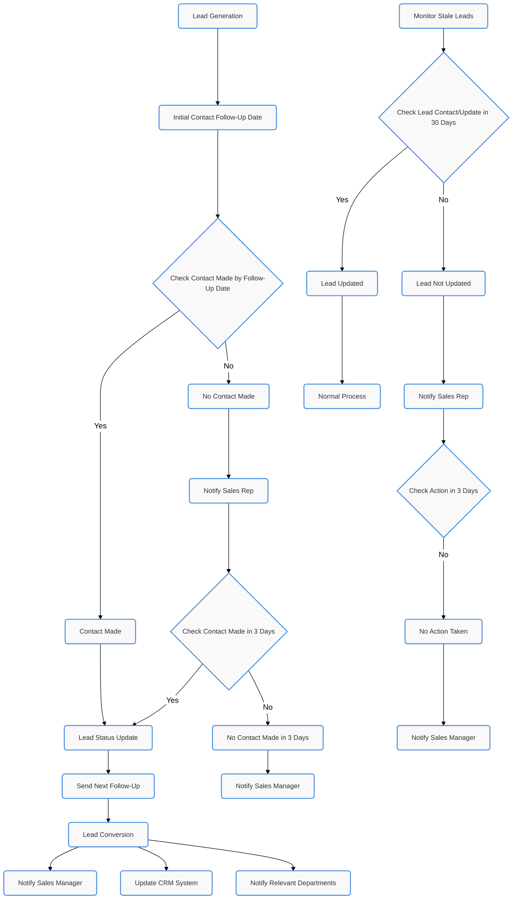
[Back to top](#TOP)

## DIGITAL AGENCY WORKFLOW

1. Project Initiation: The project begins with initiation.
2. Project Planning: Detailed planning of the project occurs.
3. Task Assignment: Tasks are assigned to team members.
4. Task Execution: Team members execute the assigned tasks.
5. Quality Assurance: The quality of the tasks is assured.
    Client Approval: The client reviews the deliverables.
       Revisions Needed: If revisions are needed, they are made and tasks are executed again.
6. Project Completion: The project is completed.
7. Project Delivery: The project deliverables are handed over to the client.
8. PostProject Review: A review of the project is conducted to identify lessons learned.
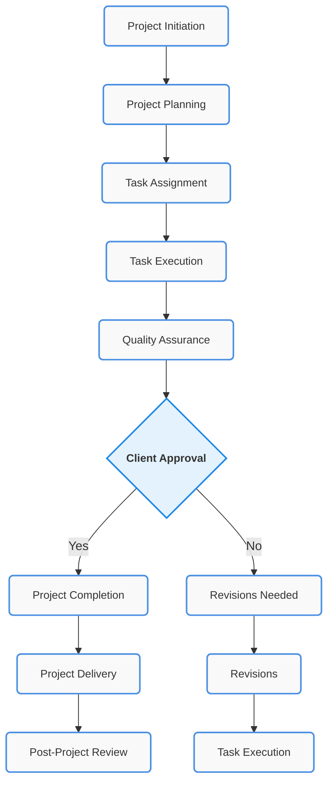
[Back to top](#TOP)

## GRAPHIC DESIGN WORKFLOW

1. Design Request Reception: Design requests are received.
2. Initial Design Variations: Initial design variations are created.
3. Client Feedback: Client provides feedback on the designs.
4. Design Finalization: The final design is prepared based on feedback.
5. Design Submission for Approval:
    Revisions Needed: If revisions are needed, they are made.
6. Final Approval: The final design is approved by the client.
7. Design Delivery: The approved design is delivered to the client.
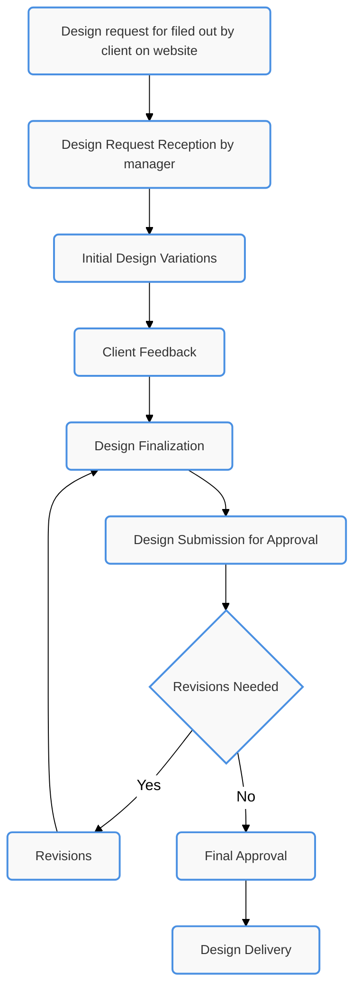
[Back to top](#TOP)

## RECIEVING INVENTORY WORKFLOW

1. Order Placement and Notification: Orders are placed and notifications are sent.
2. Receiving Shipment: The shipment is received.
3. Inspection and Quality Control:
    Items Fail Inspection: If items fail inspection, they are returned to the supplier or marked for rework.
4. Inventory Update: The inventory is updated.
5. Storage Allocation: Allocate storage space for the items.
6. PutAway Process: The items are put away in their designated storage locations.
7. Inventory Tracking: The inventory is tracked.
8. Order Fulfillment: Orders are fulfilled from the inventory.

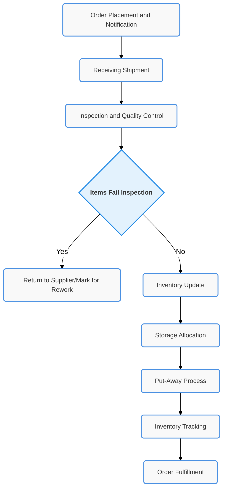
[Back to top](#TOP)

## AUTOMATED PURCHASE ORDER WORKFLOW

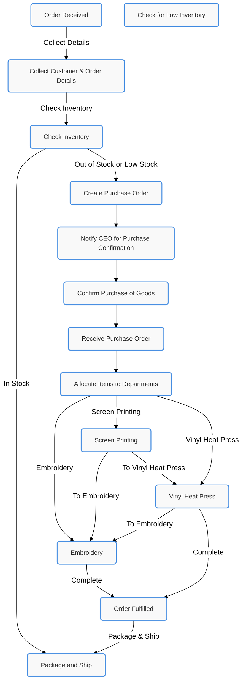

## SHOPIFY ORDERS WORKFLOW

1. Order Received: The order is received from the client's Shopify store.
2. Collect Customer & Order Details: The system collects the company name, customer name, and shipping address.
3. Check Inventory: The inventory is checked to see if the items are in stock.
     If the items are in stock, they proceed directly to packaging and shipping.
     If the items are out of stock, they are allocated to the appropriate departments for production.
4. Allocate Items to Departments: Items are allocated to different departments based on their decoration needs.
     Screen Printing: Items that need screen printing are processed first.
     Vinyl Heat Press: Items that require vinyl heat pressing are processed next.
     Embroidery: Items that require embroidery are processed last.
5. Order Fulfilled: Once all necessary decorations are complete, the order is fulfilled.
6. Package and Ship: The items are packaged and shipped to the customer.

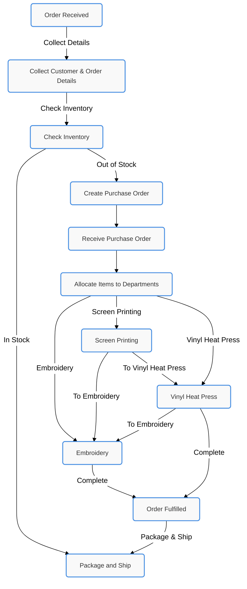

Please try using this version of your code. If the issue persists, let me know, and we can further investigate the problem.


```
[Back to top](#TOP)

## SCREEN PRINTING WORKFLOW

1. Order Reception: Orders are received.
2. Material Collection: Materials required for the order are collected.
3. Screen Preparation: Screens are prepared for printing.
4. Press Setup: The press is set up for printing.
5. Printing: The printing process is executed.
6. Drying: Printed items are dried.
7. Quality Check: Quality of the printed items is checked.
    Rework Needed: If rework is needed, the items are sent back for rework.
8. Packaging and Fulfillment: Items are packaged and fulfilled.

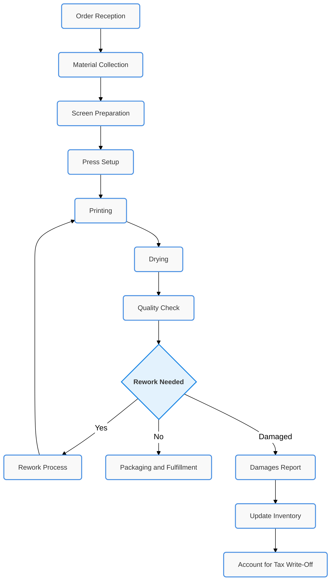
[Back to top](#TOP)

## EMBROIDERY WORKFLOW

1. Order Reception: Orders are received.
2. Material Collection: Materials required for the order are collected.
3. Design Setup: Design is set up for embroidery.
4. Embroidery Process (Start Job Timer): Embroidery process starts, and the job timer is initiated.
5. Quality Check: The quality of the embroidered items is checked.
    Rework Needed: If rework is needed, the items are sent back for rework.
6. Packaging and Fulfillment: Embroidered items are packaged and fulfilled.
7. 
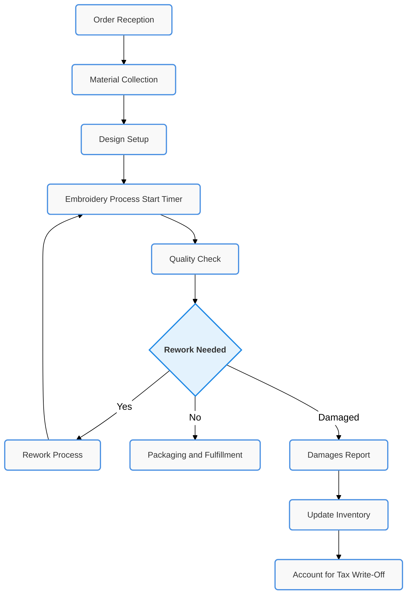
[Back to top](#TOP)


## HEATTRANSFER WORKFLOW

1. Order Reception: Orders are received.
2. Material Collection: Materials required for the order are collected.
3. Design Setup: Design is set up for the vinyl heat press.
4. Vinyl Heat Press Process (Start Job Timer): The vinyl heat press process starts, and the job timer is initiated.
5. Quality Check: The quality of the heatpressed items is checked.
    Rework Needed: If rework is needed, the items are sent back for rework.
6. Packaging and Fulfillment: Heatpressed items are packaged and fulfilled.
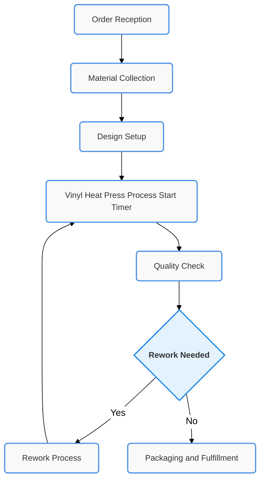
[Back to top](#TOP)

## FULFILLMENT WORKFLOW

1. Order Reception: Orders are received.
2. Packaging Preparation: Packaging is prepared.
3. Item Packaging: Items are packaged.
4. Quality Assurance Check: The quality of the packaging is checked.
    Reproduction Needed: If reproduction is needed, the process is initiated.
5. Shipping Preparation: Items are prepared for shipping.
6. Shipping and Dispatch: Items are shipped and dispatched.
7. Customer Notification: Customers are notified of the shipment.
8. Order Completion: Orders are marked as complete.
9. Returns Handling: Returns are handled.
10. Returns Inspection: Returns are inspected.
     Reproduction Needed: If reproduction is needed, the process is initiated.
11. Communicate with Customer: Communication is maintained with the customer.
    
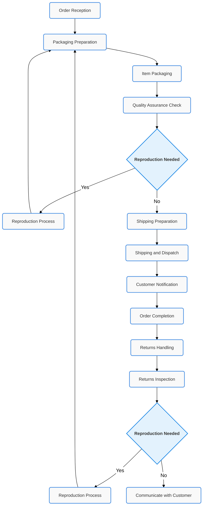
[Back to top](#TOP)

## CLOSING SALES & COMMISSION PAYOUT FLOW

1. Deal Closed by Salesperson: The salesperson closes the deal with the client.
2. Client Signs All Documents and Terms: The client signs all necessary documents and terms.
3. Receive Necessary Documents and Logo Files from Client: The necessary documents and logo files are received from the client.
4. Upload Documents for Approval: The documents are uploaded for approval.
5. Are All Documents Approved?:
    Documents Approved: If all documents are approved, proceed to close the sale.
    Documents Not Approved: If documents are not approved, they are sent back to the salesperson for completion and resubmission.
6. Sale Closed: The sale is marked as closed.
7. Commission Paid Out within Specified Time: The commission is paid out to the salesperson within the specified time.
8. Send Documents Back to Salesperson for Completion: If documents are not approved, they are sent back to the salesperson for completion and resubmission.

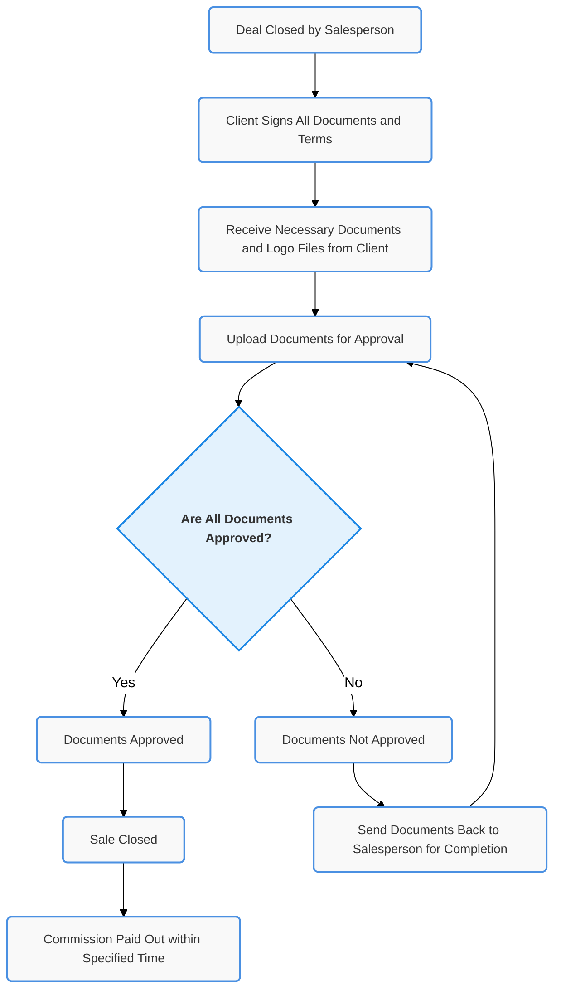
[Back to top](#TOP)
